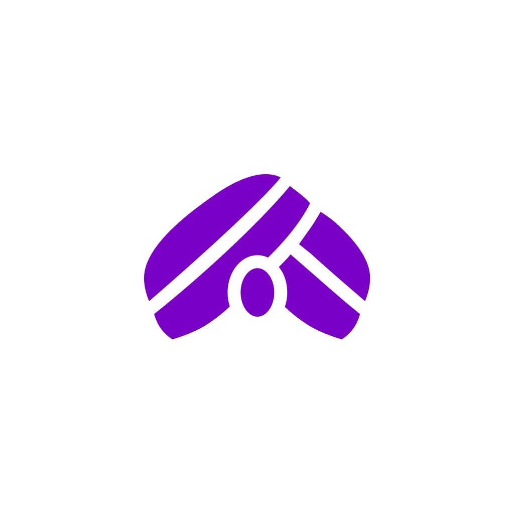

<h1 align="center">
  <br/>
  MeuGuru — Teste Prático
</h1>

<p align="center">
  Implementação <strong>pixel-perfect</strong> de um aplicativo mobile educacional com Expo + React Native, fiel ao design system Figma.
</p>

<p align="center">
  
  
  
  
</p>

---

## 📲 Download & Teste

|   Plataforma   | Como testar                                                                                                                                  |
| :------------: | :------------------------------------------------------------------------------------------------------------------------------------------- |
| 🤖 **Android** | O arquivo APK excede o limite de 100 MB do GitHub e não pode ser hospedado aqui. **Entre em contato para receber o APK diretamente.** |
|   🍎 **iOS**   | Build disponível via **TestFlight**. Entre em contato para receber o convite de acesso.                                                      |

---

## 📱 Telas

### 🏠 Home (`screens/home/Home.tsx`)

Tela principal do app, composta por quatro blocos empilhados em um `ScrollView`.

#### 1 — Título com gradiente

`GradientText` renderiza "Resolva suas atividades" com o gradiente `brandAlt` (`#7A00C6 → #8453FE → #8682FF → #56B8E2`), usando `@react-native-masked-view` + `expo-linear-gradient` por baixo dos panos.

#### 2 — HomeTabs (seletor IA / Tutores)

Dois botões lado a lado com um **pill indicator deslizante** que anima via `useSharedValue` + `withSpring` (parâmetros calibrados: `damping 25`, `stiffness 250`, `overshootClamping: true`).

| Estado  | Ícone                                                            | Texto                                |
| ------- | ---------------------------------------------------------------- | ------------------------------------ |
| Ativo   | `logo-icon` ou `fa-chalkboard-teacher-icon` com `colors.primary` | `GradientText` com `gradients.brand` |
| Inativo | mesmos ícones com `colors.textBody`                              | texto simples (`colors.textBody`)    |

A seleção é propagada para cima via prop `onChange` e controla o estado `activeTab` na Home.

#### 3 — HomeCard (card dinâmico)

Card com fundo `LinearGradient` que troca **todo o conteúdo** ao mudar de tab, com animação `FadeIn` (300 ms + spring) na entrada e `FadeOut` (150 ms) na saída (Reanimated 4).

| Tab             | Gradiente de fundo                     | Ícone principal                | Botão                                | Ação                       |
| --------------- | -------------------------------------- | ------------------------------ | ------------------------------------ | -------------------------- |
| **Com a IA**    | `cardIA` — tons azul/lilás claros      | Lottie animado em loop         | "Perguntar para IA" (roxo `primary`) | Navega para `/(tabs)/chat` |
| **Com tutores** | `cardTutores` — tons lilás/azul claros | Stack de 3 avatars sobrepostos | "Enviar atividade" (teal `#0D9488`)  | —                          |

O botão tem micro-animação de escala ao pressionar: `scale → 0.96` no `onPressIn` e volta a `1` no `onPressOut`, ambos via `withSpring`.

#### 4 — ExploreResources (grid de atalhos)

Grid 2 colunas com cabeçalho "Explore mais recursos" + link "Ver todos" (roxa). Quatro cards com ícone SVG + label, feedback de opacidade (0.75) no press.

| Ícone             | Label                 |
| ----------------- | --------------------- |
| `camera-icon`     | Resolvedor de tarefas |
| `microphone-icon` | Gravador de aula      |
| `checklist-icon`  | Gerar prova           |
| `cards-icon`      | Gerar flashcard       |

---

### 📚 Recursos (`screens/recursos/Recursos.tsx`)

Tela de catálogo de ferramentas. Título "Recursos" em semibold e grid **2 colunas × 3 linhas** (6 cards).

Cada card contém:

- **Ícone wrapper** — círculo com `backgroundColor: colors.surfaceTint`, `AssetIcon` roxo `colors.primary`
- **Título** — semibold 14px
- **Descrição** — regular 12px, `colors.textMuted`, quebra de linha explícita (`\n`)
- **Press feedback** — opacidade 0.7

| Ícone                  | Título      | Descrição                        |
| ---------------------- | ----------- | -------------------------------- |
| `cards-icon`           | Flashcards  | Memorize a matéria com cartões   |
| `file-text-icon`       | Provas      | Crie provas com a IA em segundos |
| `photo-icon`           | Imagem      | Gere imagens únicas em segundos  |
| `notes-icon`           | Documento   | Gere documentos completos        |
| `pencil-icon`          | Humanizador | Remova o tom de IA do texto      |
| `align-justified-icon` | Resumo      | Resuma textos rapidamente        |

---

### 💬 Chat (`screens/chat/Chat.tsx`)

Tela padrão ao abrir o app (`initialRouteName="chat"`). Header customizado via `ChatHeader`, conteúdo centralizado em `ScrollView` e barra de input absolutamente posicionada.

#### Header — `ChatHeader.tsx`

Três zonas horizontais:

- **Esquerda** — `Pressable` com `camera-icon` (fundo `surface`, pill arredondado)
- **Centro** — pill com `logo-icon` + texto "Guru IA" + `chevron-down` (`Ionicons`) — seletor de modelo
- **Direita** — `Pressable` com `menu-icon`

#### Greeting

`LottieView` (35×50, autoPlay + loop) + texto "Olá, Lucas!" com `colors.primary`.

#### Subtítulo

`GradientText` "Como posso te ajudar?" com `gradients.brand`.

#### Chips de sugestão

4 chips em pill (`borderRadius: full`, fundo `surfaceMuted`), cada um abre o teclado ao ser pressionado (`inputRef.current?.focus()`):

| Tipo      | Conteúdo                         | Label                          |
| --------- | -------------------------------- | ------------------------------ |
| `icon`    | `AssetIcon` `bg_removal-icon`    | Resolvedor de tarefas          |
| `image`   | PNG `camera-full-icon`           | Explorar recursos              |
| `image`   | PNG `tools-icon`                 | Enviar foto da questão         |
| `avatars` | Stack de 3 avatars (offset -4px) | Resolver atividade com Tutores |

#### Barra de input (absolutamente posicionada)

Três elementos em linha:

| Elemento          | Detalhe                                                                 |
| ----------------- | ----------------------------------------------------------------------- |
| **Botão `+`**     | Círculo 48px, `surfaceMuted`, ícone `add` (Ionicons)                    |
| **Pill de texto** | `flex: 1`, fundo `surfaceMuted`, placeholder "Pergunte ou tire foto"    |
| **Mic / Send**    | `mic-outline` (inativo) → `send` roxo `colors.primary` (teclado aberto) |

O ícone de microfone muda para **send** assim que o teclado abre (`isKeyboardOpen` state); clicar no send chama `Keyboard.dismiss()`.

#### Rastreamento de teclado

Sem `KeyboardAvoidingView`. `keyboardWillShow` escreve a altura direto em `useSharedValue` → `useAnimatedStyle` move o wrapper pixel-a-pixel no UI thread. A tab bar some via `display: "none"` enquanto o teclado está aberto.

#### Input adaptativo

Cresce linha a linha até 3 linhas (`MAX_INPUT_HEIGHT = 60px`), depois habilita scroll interno (`scrollEnabled`).

---

## 🏗️ Arquitetura

```
.
├── app/
│   ├── _layout.tsx              # Root layout (fontes, splash, Redux Provider)
│   └── (tabs)/
│       ├── _layout.tsx          # Tab bar (frosted glass, 3 tabs visíveis)
│       ├── index.tsx            # → Home
│       ├── recursos.tsx         # → Recursos
│       └── chat.tsx             # → Chat (tela padrão)
│
├── screens/                     # Lógica + layout de cada tela
│   ├── home/
│   │   ├── Home.tsx
│   │   └── styles.ts
│   ├── recursos/
│   │   ├── Recursos.tsx
│   │   └── styles.ts
│   └── chat/
│       ├── Chat.tsx
│       ├── styles.ts
│       ├── ChatHeader.tsx
│       └── ChatHeader.styles.ts
│
├── components/                  # Componentes reutilizáveis
│   ├── app-header/              # Logo + fogo + avatar
│   ├── asset-icon/              # Sistema SVG autogerado
│   ├── explore-resources/       # Grid de recursos
│   ├── gradient-text/           # Texto com gradiente linear
│   ├── home-card/               # Card animado IA / Tutores
│   └── home-tabs/               # Tabs com pill animado
│
├── theme/                       # Design tokens centralizados
│   ├── colors.ts                # Paleta semântica light + dark
│   ├── spacing.ts               # Escala base-4 + border-radius
│   ├── typography.ts            # Tamanhos, alturas, pesos, fontes
│   ├── gradients.ts             # Gradientes da marca
│   └── index.ts                 # Theme interface + useTheme + useStyles
│
├── store/                       # Redux Toolkit + redux-persist
│   ├── index.ts
│   └── slices/themeSlice.ts
│
├── hooks/
│   └── use-fonts.ts             # Carrega Inter-Regular/Medium/SemiBold
│
└── resources/
    ├── fonts/                   # 3 arquivos TTF (otimizados de 54 → 3)
    └── icons/                   # SVGs da marca
```

---

## 🎨 Design System

Todos os tokens ficam em `theme/` — **zero hex hardcoded** em componentes ou styles.

### Cores

```ts
theme.colors.primary; // #7A00C6  — roxo da marca
theme.colors.primaryMid; // #A14BD7  — borda do indicador de tab
theme.colors.primaryLight; // #B453FE  — stop do gradiente
theme.colors.textBody; // #374151  — ícones e corpo de texto
theme.colors.textMuted; // #6B7280  — texto secundário
theme.colors.surface; // #F9FAFB  — fundo de cards
theme.colors.surfaceMuted; // #F3F4F6  — chips e inputs
theme.colors.surfaceTint; // #F6EDFB  — tab indicator / bg de ícone
theme.colors.border; // #E5E7EB  — bordas
theme.colors.teal; // #0D9488  — accent tutores
```

### Espaçamento (escala base-4)

| Token            | Valor |
| ---------------- | ----- |
| `spacing.xs`     | 4px   |
| `spacing.sm`     | 8px   |
| `spacing.md`     | 12px  |
| `spacing.lg`     | 16px  |
| `spacing.xl`     | 20px  |
| `spacing["2xl"]` | 24px  |
| `spacing["3xl"]` | 32px  |
| `spacing["4xl"]` | 48px  |

### Border Radius

| Token          | Valor                    |
| -------------- | ------------------------ |
| `radii.sm`     | 8px                      |
| `radii.md`     | 10px                     |
| `radii.lg`     | 12px                     |
| `radii.xl`     | 16px                     |
| `radii["2xl"]` | 24px                     |
| `radii.full`   | 999px — pills e círculos |

### Tipografia

```ts
theme.typography.fonts.regular   → "Inter-Regular"
theme.typography.fonts.medium    → "Inter-Medium"
theme.typography.fonts.semibold  → "Inter-SemiBold"

// Tamanhos:     xs(12)  sm(14)  md(16)  lg(20)  xl(24)
// Line heights: xs(16)  sm(20)  md(24)  lg(28)  xl(32)
// Pesos:        regular(400) medium(500) semibold(600) bold(700)
```

### Gradientes

```ts
theme.gradients.brand; // [#7A00C6, #B453FE, #8682FF, #56B8E2] — brand principal
theme.gradients.brandAlt; // [#7A00C6, #8453FE, #8682FF, #56B8E2] — title home
theme.gradients.cardIA; // [#E4F1FF, #F2EAFF, #FCEBFF, #F6DFFF] — card IA
theme.gradients.cardTutores; // [#F6DFFF, #EBECFF, #EAF1FF, #E4F1FF] — card tutores
```

---

## 🧩 Componentes

### `<AssetIcon />`

Sistema de ícones SVG completamente tipado. O script `generate-icons.js` varre `resources/icons/`, gera `icons.generated.ts` com todas as chaves e um componente que importa via `react-native-svg-transformer`.

```tsx
// TypeScript acusa erro se o ícone não existir
<AssetIcon name="fire-icon" size={20} color={theme.colors.primary} />
```

### `<GradientText />`

Texto com gradiente linear usando `@react-native-masked-view` + `expo-linear-gradient`.

```tsx
<GradientText colors={theme.gradients.brand} style={styles.title}>
  Resolva suas atividades
</GradientText>
```

### `<HomeTabs />`

Tabs com pill indicator deslizante animado via `useSharedValue` + `withSpring`. Ícone ativo recebe o gradiente da marca via `GradientText`.

### `<HomeCard />`

Card com `LinearGradient` que troca de conteúdo (IA ↔ Tutores) com animação `FadeIn/FadeOut`. Botão com micro-animação de escala no press.

### `<ExploreResources />`

Grid 2 colunas de recursos navegáveis com feedback de opacidade no press.

---

## 💬 Chat

### Rastreamento de teclado

Sem `KeyboardAvoidingView`. A barra de input é `position: absolute` e sobe pixel-a-pixel com o teclado:

```ts
Keyboard.addListener("keyboardWillShow", (e) => {
  keyboardHeight.value = e.endCoordinates.height; // snap instantâneo
});

const inputBarAnimStyle = useAnimatedStyle(() => ({
  bottom: keyboardHeight.value,
  paddingBottom: Math.max(12, 89 - keyboardHeight.value),
  shadowOpacity: keyboardHeight.value > 0 ? 0.06 : 0,
}));
```

O conteúdo da tela permanece **completamente estático** enquanto o input sobe.

### Input dinâmico

Cresce linha a linha até 3 linhas, depois habilita scroll interno:

```ts
const MAX_LINES = 3;
const LINE_HEIGHT = 20;

onContentSizeChange={(e) => {
  const h = Math.min(e.nativeEvent.contentSize.height, MAX_LINES * LINE_HEIGHT);
  setInputHeight(Math.max(h, LINE_HEIGHT));
}}
```

### Tipos de chip

| Tipo      | Renderização                                      |
| --------- | ------------------------------------------------- |
| `icon`    | `<AssetIcon />` — SVG tipado                      |
| `image`   | `<Image source={require(...)} />` — PNG local     |
| `avatars` | Stack de avatares sobrepostos com offset negativo |

---

## 🗂️ Padrão de styles

Cada componente tem `styles.ts` com `createStyles(theme)` — sem StyleSheet inline no componente:

```ts
// components/algum-componente/styles.ts
export const createStyles = (theme: Theme) =>
  StyleSheet.create({
    container: {
      backgroundColor: theme.colors.background,
      paddingHorizontal: theme.spacing["2xl"],
      borderRadius: theme.radii.lg,
    },
  });
```

```tsx
// components/algum-componente/AComponente.tsx
export function AComponente() {
  const styles = useStyles(createStyles); // lê tema do Redux
  return <View style={styles.container} />;
}
```

> Quando o tema muda (light ↔ dark), todos os componentes re-renderizam automaticamente via `useAppSelector`.

---

## 🔧 Estado Global

```
store/
├── index.ts           # configureStore + redux-persist (AsyncStorage)
└── slices/
    └── themeSlice.ts  # { mode: "light" | "dark" }
```

Persiste apenas o slice de tema. `whitelist: ["theme"]` garante que estado transitório não seja persistido.

---

## 🔤 Otimização de Fontes

Foram removidos **51 arquivos TTF** desnecessários (variantes não usadas de 18pt + todos os arquivos 24pt e 28pt). O app carrega apenas o necessário:

```ts
useFonts({
  "Inter-Regular": require("@/resources/fonts/Inter_18pt-Regular.ttf"),
  "Inter-Medium": require("@/resources/fonts/Inter_18pt-Medium.ttf"),
  "Inter-SemiBold": require("@/resources/fonts/Inter_18pt-SemiBold.ttf"),
});
```

---

## ⚙️ Tab Bar

- **3 tabs visíveis:** Home · Recursos · Chat
- `expo-blur` para efeito frosted glass
- `initialRouteName="chat"` → Chat como tela padrão ao abrir o app
- Tabs 4 e 5 exibem ícones mas têm `tabPress` bloqueado (`e.preventDefault()`)

---

## 🚀 Como rodar

```bash
# Instalar dependências
yarn install

# iOS (requer Xcode)
yarn ios

# Android (requer Android Studio)
yarn android

```

> Requer Expo Go ou build de desenvolvimento com `expo-dev-client`.

---

## 🛠️ Stack completa

| Tecnologia                     | Versão | Função                              |
| ------------------------------ | ------ | ----------------------------------- |
| Expo                           | ~54    | Framework principal                 |
| Expo Router                    | ~6.0   | Navegação file-based                |
| React Native                   | 0.81   | Runtime mobile                      |
| TypeScript                     | ~5.9   | Tipagem estática                    |
| Redux Toolkit                  | 2.11   | Estado global                       |
| redux-persist                  | 6.0    | Persistência do tema                |
| react-native-reanimated        | ~4.1   | Animações performáticas (UI thread) |
| expo-linear-gradient           | ~15.0  | Gradientes                          |
| expo-blur                      | ~15.0  | Frosted glass no tab bar            |
| lottie-react-native            | ~7.3   | Animações Lottie                    |
| react-native-svg + transformer | 15.12  | Sistema de ícones SVG               |
| @react-native-masked-view      | 0.3    | GradientText                        |
| react-native-safe-area-context | ~5.6   | Insets de área segura               |

---

<p align="center">
  Feito com 💜 por <strong>Gustavo Bacellar</strong>
</p>
